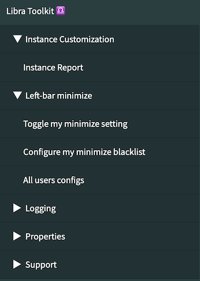
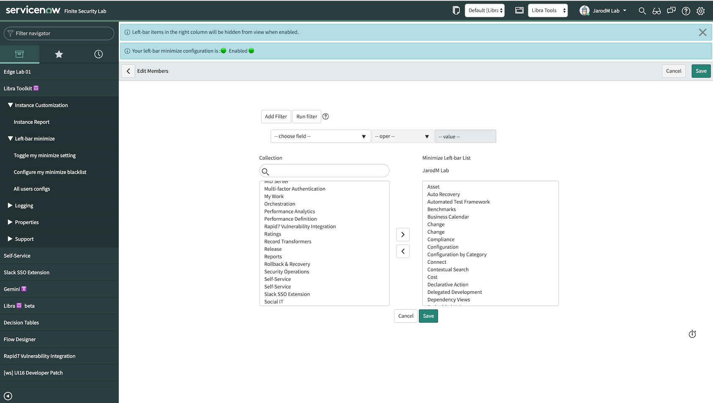
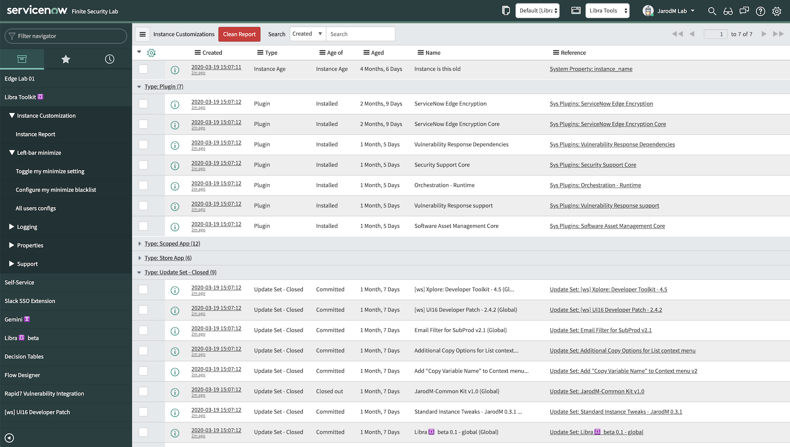

# Libra Toolkit for ServiceNow

## Summary
Libra Toolkit is a collection of utilities that have been used in my development instances for a while. It is now time to consolidate them to a single scoped app and open source them.

There are additional private scripts and utilties that will be added to this kit in the future. Subscribe to the Share item or the GitHub repo for future news.

## Quick Start

* Prerequsites: _none_

1. Download and install update set from [ServiceNow Share](https://developer.servicenow.com/connect.do#!/share/contents/1627055_libra_toolkit)
2. Explore features
3. Please return to the Share page and review 

### Left-bar minimize
Remove unwanted left-bar applications from your view, without impacting other users on the instance, and without modifying any records.

1. Browse to module: `Configure my minimize setting`
2. Move left-bar applications that you'd like to hide to the right column. Save.
3. To enable or disable: use `Toggle my minimize setting` module

### Instance Customizations
Before you zBoot your PDI, review the update sets, plugins, store apps, users, and more. Make a list of the things you need to export so it won't get lost forever.

1. Browse to module: Instance Report
2. Click `Generate Report`
3. Group-by `Type`
4. Review each category for items present in your instance
5. Can right click and `Ignore Item` or `Ignore all of this type` to remove from list
6. To export: Right-click on column header row and Export as Excel, CSV, etc...

## Contribute
Submit enhancements/defects via this repo's [Issues](../../issues)

## Credit
[Jarod Mundt](https://github.com/j4rodm)

## Screenshots

